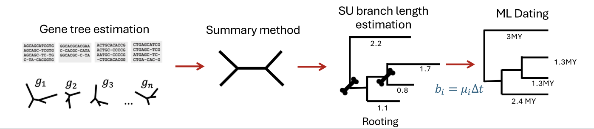

# Coalescent-based dating

This repository contains the pipeline, datasets and scripts used in the following paper:

- Y. Tabatabaee, S. Claramunt, S. Mirarab (2026). Coalescent-based branch length estimation improves dating of species trees. Systematic Biology, syag038. https://doi.org/10.1093/sysbio/syag038

For experiments in this study, we generated three sets of simulated datasets with gene tree discordance due to incomplete lineage sorting (ILS) and analyzed two avian biological datasets from [Harvey et. al. (2020)](https://www.science.org/doi/10.1126/science.aaz6970) and [Stiller et. al. (2024)](https://www.nature.com/articles/s41586-024-07323-1). The simulated datasets have model species trees with substitution-unit, generation-unit, and time-unit branch lengths. All datasets can be accessed from Dryad https://doi.org/10.5061/dryad.hmgqnk9xv.

## Dating pipeline

We provide an end-to-end pipeline for coalescent-aware divergence time estimation from gene trees. The pipeline has the following steps:

1. Infers a species tree topology using [ASTRAL/ASTER](https://github.com/chaoszhang/ASTER).
2. Estimates coalescent-aware branch lengths using [CASTLES-Pro](https://github.com/ytabatabaee/CASTLES).
3. Converts substitution-unit branch lengths into time units using an ML-based dating method.



### Installation
To run the dating pipeline, follow these commands.
```bash
git clone https://github.com/ytabatabaee/coalescent-based-dating.git
cd coalescent-based-dating

conda create -n cbdating python=3.10
conda activate cbdating
conda install -c bioconda astral-tree newick_utils
```

In addition, you need to install the ML-based dating methods you plan to use. The pipeline currently supports [TreePL](https://github.com/blackrim/treePL), [MD-Cat](https://github.com/uym2/MD-Cat), [wLogDate](https://github.com/uym2/wLogDate), and [LSD2](https://github.com/tothuhien/lsd2). To suggest additional dating methods, please submit an issue.

### Usage

The pipeline can be used to infer the species tree and date it, or use a user-provided species tree. To run either pipeline, use the following command:
```bash
python run_pipeline.py \
    --gene-trees <gene-tree-file> \
    [--species-tree <species-tree-file>] \
    --calibrations <calibration-file> \
    --method <dating-method> \
    [--outgroup <outgroup-name>] \
    [--CI "<num-samples> <lower-quantile> <upper-quantile>"] \
    --output <output-directory>
```

### Arguments

- `--gene-trees`       gene trees in Newick format
- `--species-tree`     optional user-provided species tree topology in Newick format
- `--calibrations`     calibration file
- `--method`           dating method (currently supports `treepl`, `mdcat`, `wlogdate`, `lsd2`)
- `--outgroup`         optional outgroup taxon name for rooting the species tree before dating
- `--output`           output directory
- `--CI`               MD-Cat confidence intervals (`num_samples lower_quantile upper_quantile`)
- `--seq-length`       optional sequence length passed to MD-Cat
- `--mdcat-p`          MD-Cat `-p` value (default: `10`)

The three `--CI` values are user-controlled. For example, `--CI "1000 0.025 0.975"` computes 95\% confidence intervals from 1000 posterior samples, while `--CI "100 0.05 0.95"` uses 100 samples and the 5th/95th percentiles (90\% confidence intervals). Confidence intervals are currently supported only for `--method mdcat`.

### Calibration Format

Different ML-based dating methods use different calibration formats for pre-specified times. TreePL can use minimum/maximum bounds, such as 

```text
mrca = calib1 taxonA taxonB
min = calib1 66
max = calib1 72

mrca = calib2 taxonC taxonD
min = calib2 120
max = calib2 135
```

MD-Cat, wLogDate, LSD2, and TreePL also accept fixed node ages using either
internal node labels or the MRCA of two terminal nodes:

```text
i1 8.055
i7 2.812
i16 3.393
mrca(24,3) 7.534
mrca(taxonA,taxonB) 66.0
```

For `mrca(taxonA,taxonB)` entries, the pipeline labels the corresponding
internal node before running dating methods that require node labels. For
TreePL, the pipeline converts fixed-age entries to equivalent minimum and
maximum bounds internally.

### Outputs
The output directory includes the following files
```text
results/
├── species_tree_su.tre
├── dated_tree.tre
├── logs/
└── intermediate/
```
where
- `species_tree_su.tre` is the species tree with CASTLES-Pro substitution-unit branch lengths.
- `dated_tree.tre` is the time-calibrated species tree dated using the selected method.

When `--CI` is used with MD-Cat, `dated_tree.tre` includes confidence interval annotations. `logs` and `intermediate` directories include config and intermediate files generated by the dating methods.

### Example
The [example/](https://github.com/ytabatabaee/coalescent-based-dating/tree/main/example) directory includes one sample 30-taxon dataset.
```bash
python run_pipeline.py \
    --gene-trees example/gene_trees.tre \
    --species-tree example/species_tree.tre \
    --calibrations example/calibrations.txt \
    --method mdcat \
    --CI "100 0.05 0.95" \
    --output results/example/
```

## Simulated datasets

### 30-taxon dataset
This dataset has six model conditions with varying deviation from the molecular clock and inclusion of an outgroup, each with 100 replicates. The model conditions are specified as `outgroup.[has-OG].species.[DEV].genes.[DEV]` where `[has-OG]` is 1 when the dataset has an outgroup and 0 otherwise, and `[DEV]` shows the level of deviation from the clock (parameter α of the gamma distribution) that is set to 5 (low), 1.5 (medium), or 0.15 (high). Original dataset is from [Mai at al. (2017)](https://journals.plos.org/plosone/article?id=10.1371/journal.pone.0182238) and available at [https://uym2.github.io/MinVar-Rooting/](https://uym2.github.io/MinVar-Rooting/). Below is a description of files in each directory.

- `truegenetrees`: true gene trees
- `estimatedgenetre.gtr`: gene trees estimated under GTR evolution model
- `s_tree.trees`: true species tree in substitution units
- `s_tree_gu.trees`: true species tree in generation units
- `s_tree_tu_5.trees`: true species tree in time units (million years), assuming an average generation time of 5 years
- `s_tree_unit_ultrametric.trees`: unit ultrametric true species tree
- `s_tree_tu_5_calibrations_n[num-calib]_[root_unfixed].txt`: calibration information (given in the format of (node, time) pairs)
- `s_tree_tu_5_calib_n[num-calib]_[root_unfixed]_mcmctree.ctl`: control file for MCMCTree
- `s_tree_tu_5_calib_n[num-calib]_[root_unfixed]_mcmctree.date.nwk[.normalized]`: tree dated with MCMCTree with [num-calib] calibration points. The .[normalized] flag specifies the unit-ultrametric version of the dated tree.
- `RAxML_result.concat_align_s_tree.trees.rooted.labeled`: true species tree furnished with RAxML SU branch lengths
- `castlespro_estimatedgenetre.gtr_s_tree.trees.rooted.labeled`: true species tree furnished with CASTLES-Pro SU branch lengths
- `[dating-method]_n[num-calib]_[root_unfixed]_RAxML_result.concat_align_s_tree.trees.rooted.labeled.[normalized]`: RAxML SU tree dated with [dating-method] (can be treepl, wlogdate, mdcat, and lsd2) with [num-calib] calibration points. The .[normalized] flag specifies the unit-ultrametric version of the dated tree. Trees dated with lsd2 have a `.date.nwk` extension.
- `[dating-method]_n[num-calib]_[root_unfixed]_castlespro_estimatedgenetre.gtr_s_tree.trees.rooted.labeled.[normalized]`: CASTLES-Pro SU tree dated with [dating-method] (can be treepl, wlogdate, mdcat, and lsd2) with [num-calib] calibration points. The .[normalized] flag specifies the unit-ultrametric version of the dated tree. Trees dated with lsd2 have a `.date.nwk` extension.
- `[dating-method]_CI_n[num-calib]_[root_unfixed]_castlespro_estimatedgenetre.gtr_s_tree.trees.rooted.labeled.[normalized]`: same as above but with each branch  annotated with confidence intervals for branch lengths and node ages.
- `ad.txt` : average RF distance between the model species tree and true gene trees
- `gtee_gtr.txt`: average RF distance between true and estimated gene trees


### 101-taxon dataset
This dataset has four model conditions with varying sequence lengths (1600bp, 800bp, 400bp, 200bp) corresponding to different levels of gene tree estimation error (23%, 31%, 42%, and 55%). The original dataset is from [Zhang et. al. (2018)](https://bmcbioinformatics.biomedcentral.com/articles/10.1186/s12859-018-2129-y) and available at [https://gitlab.com/esayyari/ASTRALIII/](https://gitlab.com/esayyari/ASTRALIII/). Below is a description of files in each directory.

- `truegenetrees`: true gene trees
- `fasttree_genetrees_[seq-len]_non.[num-genes]`: [num-genes] gene trees estimated from sequence alignments with length [seq-len]bp
- `s_tree.trees`: true species tree in substitution units
- `s_tree_gu.trees`: true species tree in generation units
- `s_tree_tu_5.trees`: true species tree in time units (million years), assuming an average generation time of 5 years
- `s_tree_unit_ultrametric.trees`: unit ultrametric true species tree
- `s_tree_tu_5_calibrations_n[num-calib]_[root_unfixed].txt`: calibration information (given in the format of (node, time) pairs)
- `RAxML_result.concat_for_fasttree_[seq-len].[num-genes]_s_tree.trees.rooted.labeled`: true species tree furnished with RAxML SU branch lengths given a concatenation of [seq-len]bp sequences for the first [num-genes] genes
- `castlespro_fasttree_genetrees_[seq-len]_non.[num-genes]_s_tree.trees.rooted.labeled`: true species tree furnished with CASTLES-Pro SU branch lengths given [num-genes] FastTree gene trees estimated from [seq-len]bp sequences
- `ad.txt` : average RF distance between the model species tree and true gene trees
- `[dating-method]_n[num-calib]_[root_unfixed]_castlespro_fasttree_genetrees_[seq-len]_non.[num-genes]_s_tree.trees.rooted.labeled.[normalized]`: CASTLES-Pro SU tree dated with [dating-method] (can be treepl, wlogdate, mdcat, and lsd2) with [num-calib] calibration points for the model condition corresponding to [num-genes] genes and [seq-len]bp sequences. The .[normalized] flag specifies the unit-ultrametric version of the dated tree. Trees dated with lsd2 have a `.date.nwk` extension. Files with additional extensions include config files and log files for each method.
- `[dating-method]_n[num-calib]_[root_unfixed]_RAxML_result.concat_for_fasttree_[seq-len].[num-genes]_s_tree.trees.rooted.labeled.[normalized]`: RAxML SU tree dated with [dating-method] (can be treepl, wlogdate, mdcat, and lsd2) with [num-calib] calibration points for the model condition corresponding to [num-genes] genes and [seq-len]bp sequences. The .[normalized] flag specifies the unit-ultrametric version of the dated tree. Trees dated with lsd2 have a `.date.nwk` extension. Files with additional extensions include config files and log files for each method.

### Large dataset
This dataset has 8 model conditions with 50, 100, 200, 500, 1K, 2K, 5K, and 10K-taxon trees with 20 replicates in each condition. Below is a description of files in each directory `large/[num-taxa]/[rep-num]/` where `[num-taxa]` is the model condition (number of taxa) and `[rep-num]` is the replicate index.

- `truegenetrees`: true gene trees
- `estimatedgenetre`: estimated gene trees
- `s_tree.trees`: true species tree in substitution units
- `s_tree_gu.trees`: true species tree in generation units
- `s_tree_tu_5.trees`: true species tree in time units (million years), assuming an average generation time of 5 years
- `s_tree_unit_ultrametric.trees`: unit ultrametric true species tree
- `s_tree_tu_5_calibrations_n[num-calib].txt`: calibration information
- `RAxML_result.concat_s_tree.trees.rooted.labeled`: true species tree furnished with RAxML SU branch lengths
- `castlespro_estimatedgenetre_s_tree.trees.rooted.labeled`: true species tree furnished with CASTLES-Pro SU branch lengths
- `treepl_n[num-calib]_RAxML_result.concat_s_tree.trees.rooted.labeled`: RAxML SU tree dated with TreePL with [num-calib] calibration points
- `treepl_n[num-calib]_RAxML_result.concat_s_tree.trees.rooted.labeled.config`: config file for TreePL for the RAxML dated tree
- `treepl_n[num-calib]_castlespro_estimatedgenetre_s_tree.trees.rooted.labeled`: CASTLES-Pro SU tree dated with TreePL with [num-calib] calibration points
- `treepl_n[num-calib]_castlespro_estimatedgenetre_s_tree.trees.rooted.labeled.config`: config file for TreePL for the CASTLES-Pro dated tree
- `ad.txt` : average RF distance between the model species tree and true gene trees
- `gtee.txt` : average RF distance between true and estimated gene trees


## Biological datasets

- **Neoavian**: 363-taxon neoavian dataset from [Stiller et al. (2024)](https://www.nature.com/articles/s41586-024-07323-1) with 63,430 single-copy genes. The original data is available [here](https://sid.erda.dk/cgi-sid/ls.py?share_id=ENhZODU9YE). Results from the analysis in this study is available at [/biological/avian-stiller](https://github.com/ytabatabaee/coalescent-based-dating/tree/main/biological/avian-stiller). Below is a description of files in this directory.

- `mdcat_[CI]_median_40Kl_caml_stiller.rooted.tre`: ASTRAL tree furnished with ConBL branch lengths dated with MD-Cat. The `CI` flag denotes confidence intervals.
- `mdcat_[CI]_median_40Kl_astral4_stiller_nolabel.rooted.tre`: ASTRAL tree furnished with CASTLES-Pro branch lengths dated with MD-Cat. The `CI` flag denotes confidence intervals.
- `wlogdate_median_astral4_stiller.rooted.no_label.tre`: ASTRAL tree furnished with CASTLES-Pro branch lengths dated with wLogDate
- `wlogdate_median_astral_63K_concat_bl.rooted.no_label.tre`: ASTRAL tree furnished with ConBL branch lengths dated with wLogDate
- `treepl_median_astral_63K_concat_bl.rooted.tre`: ASTRAL tree furnished with ConBL branch lengths dated with TreePL
- `treepl_median_castlespro_stiller.rooted.tre`: ASTRAL tree furnished with CASTLES-Pro branch lengths dated with TreePL
- `genera_castlespro_concat.csv`: Age of genera estimated using different dating methods with CASTLES-Pro or ConBL branch lengths on concatenation or ASTRAL topology
- `families_castlespro_concat.csv`: Age of families estimated using different dating methods with CASTLES-Pro or ConBL branch lengths on concatenation or ASTRAL topology
- `orders_castlespro_concat.csv`: Age of orders estimated using different dating methods with CASTLES-Pro or ConBL branch lengths on concatenation or ASTRAL topology
- `ltt_stiller.csv`: Lineage-through-time information for different dated trees
- `fossil_list_median.txt`: Fossil calibration information for median (50\% quantiles)


- **Suboscines**: 1683-taxon suboscines dataset from [Harvey et. al. (2020)](https://www.science.org/doi/10.1126/science.aaz6970) with 2,389 single-copy genes. The original data is available at https://github.com/mgharvey/tyranni. Results from the analysis in this study is available at [/biological/suboscines-harvey](https://github.com/ytabatabaee/coalescent-based-dating/tree/main/biological/suboscines-harvey). Below is a description of files in this directory.

- `concat_T400F.examl.rooted.tre`: Concatenation tree furnished with CAML branch lengths
- `castlespro_T400F.examl.rooted.tre`: Concatenation tree furnished with CASTLES-Pro branch lengths
- `treepl_castlespro_T400F.astral.rooted.tre`: ASTRAL tree furnished with CASTLES-Pro branch lengths dated with TreePL
- `treepl_examl_T400F.astral.rooted.tre`: ASTRAL tree furnished with CAML branch lengths dated with TreePL
- `treepl_castlespro_T400F.examl.rooted.tre`: Concatenation tree furnished with CASTLES-Pro branch lengths dated with TreePL
- `treepl_concat_T400F.examl.rooted.tre`: Concatenation tree furnished with CAML branch lengths dated with TreePL
- `genera_treepl_castlespro_concat.csv`: Age of different genera estimated using TreePL+CASLTES-Pro andTreePL+ConBL on the concatenation topology
- `families_treepl_castlespro_concat.csv`: Age of different families estimated using TreePL+CASLTES-Pro andTreePL+ConBL on the concatenation topology
- `suboscines_ltt.csv`: Lineage-through-time information for the four different dated trees (ASTRAL or CAML furnished with CASTLES-Pro or ConBL)
